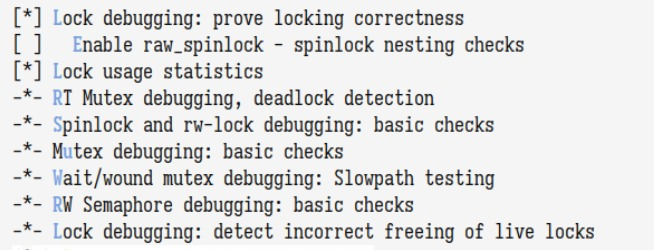

# Linux Kernel Configuration with Lockdep Module

This repository contains Linux kernel version 6.12.7 configured with kernel debugging features enabled, specifically focusing on the lockdep (lock dependency) module.

## Prerequisites

Before starting, ensure you have the following dependencies installed:

- `bc` - Basic calculator
- `bison` - Parser generator
- `flex` - Fast lexical analyzer generator
- `fakeroot` - Tool for simulating superuser privileges
- Base development tools (gcc, make, etc.)

For Arch Linux users, you can check your current kernel configuration:
```bash
zcat /proc/config.gz
```

## Repository Contents

This repository includes:

1. `.config` - The kernel configuration file with lockdep and debugging options enabled
2. `images/` - Directory containing screenshots of kernel configuration options
3. `steps.txt` - Quick reference guide for kernel compilation steps
4. `README.md` - Detailed documentation of the process

### Optional but Recommended Files to Track

- `System.map` - Symbol table for debugging
- Any custom scripts you create for automating the build process
- Patch files if you make any custom modifications to the kernel source

### Files to Ignore

The following should not be included in the repository:
- Compiled kernel files (`vmlinux`, `*.o`, `*.ko`)
- Build artifacts and temporary files
- Large binary files


## Configuration and Build Steps

### 1. Configure the Kernel
```bash
make menuconfig
```
Navigate through the menu:
- Select "Kernel Hacking"
- Navigate to the Lock Debugging section
- Enable the following options:



Available debugging options:
- Lock debugging: prove locking correctness
- Enable raw_spinlock - spinlock nesting checks
- Lock usage statistics
- RT Mutex debugging, deadlock detection
- Spinlock and rw-lock debugging: basic checks
- Mutex debugging: basic checks
- Wait/wound mutex debugging: Slowpath testing
- RW Semaphore debugging: basic checks
- Lock debugging: detect incorrect freeing of live locks

These options enable various lock-related debugging features that help detect:
- Lock dependency issues
- Deadlock conditions
- Incorrect lock usage
- Lock nesting problems
- Basic lock correctness

### 2. Save Configuration
The configuration will be saved to `.config` file in the kernel source directory.

### 3. Build the Kernel
Compile the kernel using multiple threads:
```bash
make -j12
```
The `-j` flag enables parallel compilation:
- The number after `-j` (12 in this case) specifies the number of parallel jobs
- Generally, set this to the number of CPU cores (or threads) you have, plus one or two
- For example:
  - For a 6-core/12-thread CPU, use `-j12`
  - For a 4-core/4-thread CPU, use `-j4`
- You can check your CPU cores/threads using: `nproc` or `lscpu`

This parallel compilation significantly reduces build time compared to single-threaded compilation.

### 4. Install Kernel Modules
Install the compiled kernel modules:
```bash
sudo make modules_install
```

### 5. Install the Kernel
Either use the automated install:
```bash
sudo make install
```

Or manually copy the kernel image:
```bash
sudo cp arch/x86/boot/bzImage /boot/vmlinuz-linux-custom
```

This step will place the compiled kernel in your boot directory with a custom name.

### 6. Update Boot Configuration
Update GRUB configuration to include the new kernel:
```bash
sudo grub-mkconfig -o /boot/grub/grub.cfg
```

## Verification

After rebooting, you can verify the new kernel is running:
```bash
uname -r
```

## Notes

- Make sure to back up important data before installing a custom kernel
- If the system fails to boot with the new kernel, you can still boot with the old kernel through the GRUB menu
- The lockdep module provides runtime locking correctness validator, useful for debugging kernel lock dependencies
